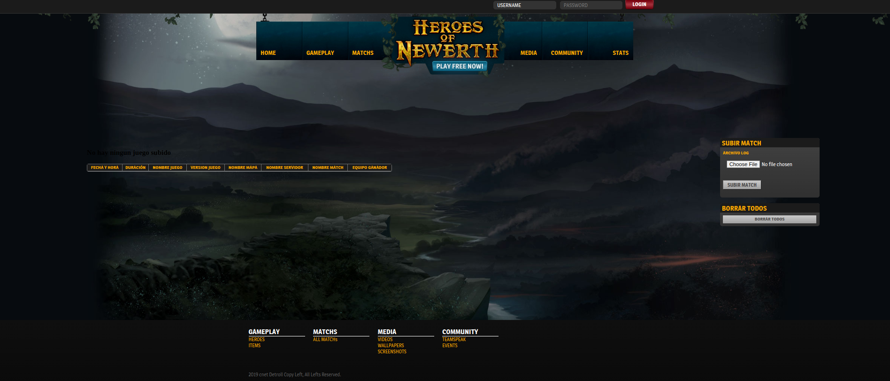
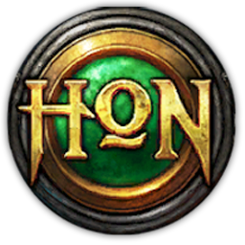

***

This project it's a web application to show some stats from the logs of the game Moba [HoN](https://en.wikipedia.org/wiki/Heroes_of_Newerth). Currently support only two versions of the game:

- Official version 3.2.1.2
- Russian version 1.0.45b

The intention of this project is to show some game stats and give puntutation to some in-game actions to promote freindly competition. Was developed to be used by friends and enjoy together with this amazing moba.

## Index

#### How to install

- [install instructions](.asssets/install.md)

#### Use this Hon Stats application

- [How to use it](.assets/useit.md)
